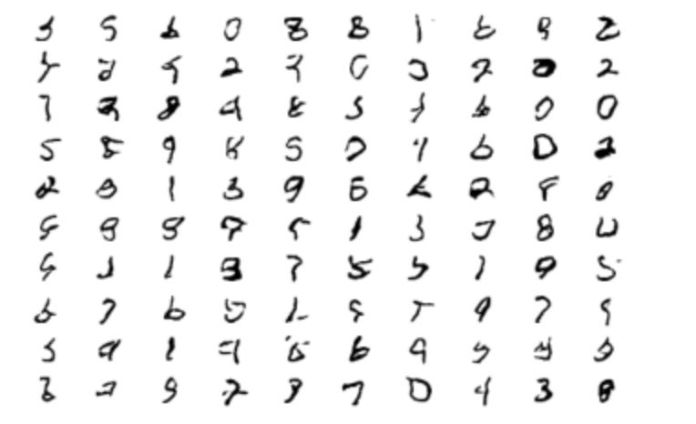

# Federated GAN
## Project Description:
For our project, we delved into the field of Federated Learning. Federated learning is a form of distributed machine learning where the data originates from many different endpoints owned by users of a product. The collected data is used to train a central model. 

Our project was inspired by [this](https://arxiv.org/pdf/1911.06679.pdf) paper by Augenstein et al. The paper describes a problem that commonly arises in Federated Learning. Often, data collected on the federated endpoints is private and should remain bound to the device. It is not acceptable to send this data back to a central server. Modern Federated Learning systems get around this issue by having the endpoints compute gradient updates based on their most up-to-date knowledge of the central model. These gradients are sent to the central server, while the user data remains private.

However, this setup leads to some further challenges for designers of Federated Learning systems. Suppose that a bias exists in the model. The model was created with an expectation that it would be used a certain way, but the data that is collected from users does not meet these expectations in reality. In a non-federated model, this type of issue is often easy to catch and resolve, because we can manually inspect the data. However, in a federated model that must respect privacy, directly inspecting the model's input data is simply not an option. Augenstein et al. proposes that we can instead create generative models based on users' data. Then, by inspecting the data points created by the generative models, we can get a good idea of what input our model is getting without needing to directly inspect user data.

For our project, we wanted to explore how generative models can be useful for identifying bias in federated models. We created and trained a basic feed-forward neural network model for the federated MNIST dataset, which has 10 classes. We then added bias to the model by incorporating the false assumption that actually, the dataset has 9 classes. We observed a substantial difference in validation loss, and we also saw that the model could be fixed easily if the bias was detected and addressed early. 

Next, we wanted to investigate ways to detect this bias without directly inspecting the data. We constructed a Federated GAN (Generative Adversarial Model) based on the [FedGAN](https://arxiv.org/pdf/2006.07228.pdf) paper. We trained the model on a federated MNIST dataset to construct images similar to the real images in the dataset. The images are sufficiently high-quality to detect the true number of classes in the dataset (10) and fix the bias issue. 

## Repository Description:
All of the code for our project is contained within the two iPython Notebooks inside this repository. [FederatedLearningWithBias.ipynb](FederatedLearningWithBias.ipynb) trains biased and unbiased models on Federated versions of MNIST and compares their performance. [FedGAN.ipynb](FedGAN.ipynb) uses a GAN to detect the true structure of the MNIST dataset (specifically, that there are 10 classes) without doing any manual inspection of the data itself. 

## How to run the code:
Simply open the two iPython notebooks in Jupyter and run them. You will likely want to use a GPU, as otherwise the GAN training will be extremely slow (the runtime of the FedGAN is on the order of hours even with a fast V100 GPU).

## Results and observations
When we ran our biased federated model on MNIST, we were clearly able to see that the loss was substantially higher than for the unbiased model:

If we start with a biased model, and then "recover" after detecting and fixing the bias, we instead get the blue loss curve below:

But our GAN can generate accurate examples that are fairly representative of user input, and can help us decide that there are, indeed, 10 classes in our dataset:

This GAN has been trained for 250 epochs. The image fidelity was still improving noticeably over time, and we could likely do even better if we trained for even more epochs. 